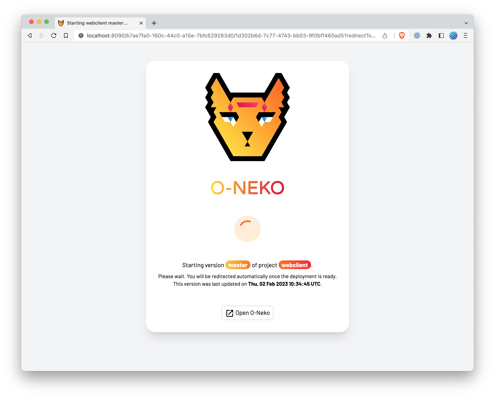

# O-Neko Catnip

[](https://circleci.com/gh/subshell/o-neko-catnip/tree/master)
[](https://hub.docker.com/r/subshellgmbh/o-neko-catnip/tags)

This is an optional extension application for [O-Neko](https://github.com/subshell/o-neko/). Its purpose is to be used as a default backend / default ingress
for stopped O-Neko deployments. It will then try to start the deployment with the URL it has been loaded with and will then redirect the user to the deployment
once it started.

<td></td>

## Why

Assuming you have multiple projects in O-Neko with many engineers working on these projects. A lot of O-Neko controlled deployments may be created in a short
time. To save on infrastructure costs you might configure O-Neko to stop deployments in the evening or when a week ends. Yet, the features or bugfixes these
deployments are associated with may still be in development. Assuming further that you link to those deployments from your ticketing system like Jira or Trello,
GitLab, GitHub (etc.), you will quickly have "dead links" as a result of the automatic stopping of those deployments.

Now let's imagine that the testing for a feature begins on a monday morning. The deployment was stopped on friday night and now the engineer doing the tests
clicks on the link in their ticket, unaware it might be a "dead" link. This is where this tool kicks in. If it is configured to be the default backend in your
Kubernetes cluster (e.g. for a specific subset of URLs), it will instruct O-Neko to start the deployment and host a simple website (see the screenshot above)
informing the visitor that the corresponding deployment is about to start. When the actual deployment is ready to receive requests, the user will automatically
be redirected to the desired frontend.

## Configuration

The application requires little configuration - only the O-Neko base-URL, the default URL of O-Neko Catnip as well a username and password need to be configured. It can be configured by placing
an `application.yaml` file next to the executable or in a `config` directory next to the executable. The structure of the configuration file is:

```yaml
oneko:
  api:
    baseUrl:
    auth:
      username:
      password:
  catnipUrl:
  server:
    port: 8080
  logging:
    level:
```

**All properties can be set using environment variables** without a configuration file. This should be preferred, especially when it comes to the user's
credentials!
The environment variables have the same names as the properties in the YAML file but capitalized with underscores as a separator, e.g. `ONEKO_API_AUTH_PASSWORD`
or `ONEKO_API_BASEURL`.

## Limits

This tool will only trigger wake-ups of deployments when receiving GET requests. Other request types will not result in a wake-up.

## Metrics

Application metrics are available at the `/metrics` endpoint in the Prometheus format.

## Development Setup

Ideally you're able to deploy this application to Kubernetes and have a running O-Neko test instance at hand to connect this tool to.

### Tools

To build this tool some tooling is required. Other tools might be interesting but are optional and mainly used in CI.

#### Required

* Go >=1.19
* Docker
* Make
* [UPX](https://upx.github.io)

#### Optional

* [gotestsum](https://github.com/gotestyourself/gotestsum): We use it to run our tests in CI
* [golangci-lint](https://github.com/golangci/golangci-lint): Used for linting


* * *

Take a look at this project from the [subshell](https://subshell.com) team. We make [Sophora](https://subshell.com/sophora/): a content management software for content creation, curation, and distribution. [Join our team!](https://subshell.com/jobs/) | [Imprint](https://subshell.com/about/imprint/)

